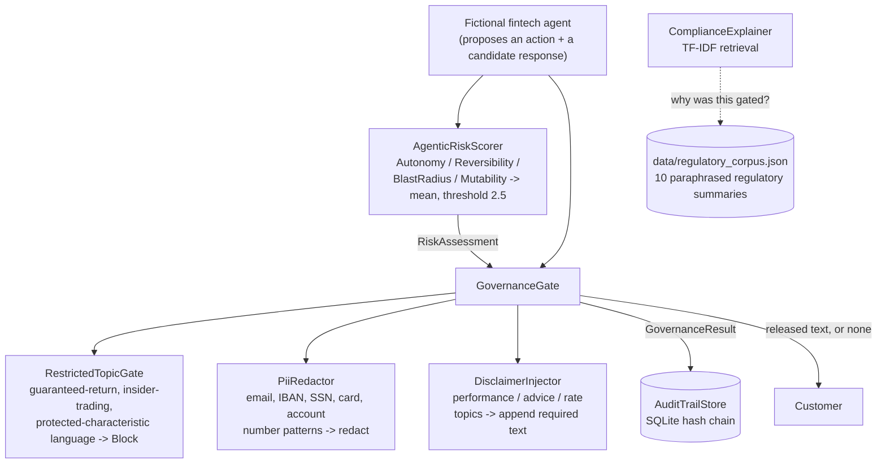

# Fintech GenAI Governance Toolkit

A small .NET toolkit implementing the mechanisms the companion
[GenAI Governance in Fintech field guide](../genai-governance-fintech-field-guide.html)
(Tier 5) describes rather than just citing them: mechanical enforcement of
PII redaction, restricted-topic blocking, and disclaimer injection outside
an LLM's own interpretive loop (arXiv 2605.14744); a four-dimension
Agentic Risk Score gating autonomous execution (arXiv 2608.02311); a
tamper-evident, hash-chained audit trail; and a retrieve-then-explain
compliance assistant grounded in a small regulatory corpus instead of an
LLM's own (unverifiable) recollection of what a regulation says (arXiv
2506.01093). Built as the practical half of "CCA-P applied to fintech" --
Anthropic's Claude Certified Architect – Professional material framed against a
regulated industry's actual constraints.

## Problem

Most "AI governance" advice for regulated industries stays at the policy
level: a document saying the model should not reveal account numbers,
should not promise guaranteed returns, and should escalate high-stakes
actions to a human. arXiv 2605.14744's core argument (Section 03 of the
field guide) is that a policy enforced only through the model's own
instruction-following is a policy that degrades under paraphrase,
adversarial pressure, and plain bad luck and that the fix isn't a
better prompt, it's moving enforcement to code that runs on the model's
*output*, outside its interpretive loop entirely, where a check either
fires or it doesn't. This repo builds that second thing: four small,
boring, deterministic components, each doing one governance job a prompt
alone cannot reliably guarantee.

## Architecture



`GenAiGovernance.Domain` holds the plain records (`RiskFactors`,
`RiskAssessment`, `GovernanceVerdict`, `GovernanceResult`, `AuditEntry`)
with zero logic. `GenAiGovernance.Core` holds everything that does
something: the scorer, the three mechanical rules under `Rules/`, the
gate that combines them, the audit store, and the compliance explainer.
`GenAiGovernance.Demo` wires all four together over five scenarios chosen
to exercise every path through the gate.

## Decisions and trade-offs

**The risk-scoring formula is an unweighted mean, on purpose, even though
a weighted version is the obvious "improvement."** arXiv 2608.02311's own
worked examples use an unweighted mean over the four dimensions, and
`AgenticRiskScorer`'s doc comment explains why staying unweighted matters
more than it looks: a weighted version invites each institution to
quietly tune the weights until whichever action they wanted to
auto-execute clears the bar, which defeats the entire point of a
mechanical, auditable score. If an institution has a real reason to treat
Mutability as more load-bearing than Autonomy, that's a policy decision
to make explicitly and document, not something the scorer should default
to silently.

**Redact vs. block is a deliberate, hard-coded split, not a
per-rule-configurable choice.** `PiiRedactor` always rewrites and allows;
`RestrictedTopicGate` always blocks outright. The reasoning is in
`RestrictedTopicGate`'s doc comment: there's no safe rewrite for "I
guarantee a 12% return" the way there is for an account number (you
cannot un-guarantee a guarantee by substituting a placeholder), so
letting a call site configure a guarantee claim to be "redacted" instead
of blocked would be a way to accidentally ship a compliance violation
with extra steps.

**The risk gate outranks the content gates, always.** `GovernanceGate`
checks `RiskAssessment.Level` first and returns `RequireHumanApproval`
immediately if it's at or above threshold -- even for an action whose
proposed text is completely clean. A textually perfect response
describing an autonomous, irreversible, systemic pricing change still
doesn't auto-execute, because the risk being gated is about *what the
agent is about to do*, not *what it's about to say*. The content checks
still run first internally so their verdicts land in the audit entry (a
human reviewing why an action was escalated should see whether the
proposed text also would have tripped a content rule), but they cannot
override the risk gate's verdict.

**The audit trail is tamper-evident, not tamper-proof, and the toolkit
says so.** `AuditTrailStore` cannot stop someone with direct database
access from editing a row -- no application-level construction over a
file the operator's own account can write to can promise that. What it
guarantees is that such an edit is *detectable*: `VerifyChain()` recomputes
every row's hash from its stored fields and confirms the chain of
`PriorHash -> EntryHash` links is unbroken. See "Verification" below for
a live SQLite run that actually tampers with a row and confirms the check
catches it, rather than just asserting the construction works.

**`ComplianceExplainer` uses hand-rolled TF-IDF, not an embedding model,
on purpose.** The field guide's Section 05 argument (arXiv 2506.01093) is
that regulatory grounding is a retrieval problem over a small, curated,
versioned corpus the institution controls not a generation problem
where an LLM might produce a fluent, wrong citation from its training
data. Given that framing, classic TF-IDF cosine similarity is the right
tool, not a limitation: it's deterministic, needs no model weights, and
its ranking is trivially explainable (which exact words in the query
matched which exact words in the retrieved document). Every entry in
`data/regulatory_corpus.json` is a paraphrased summary with an explicit
"not legal text" caveat in its `source` field, because retrieval quality
is being demonstrated here, not legal accuracy a real deployment would
point this same retrieval mechanism at an institution's actual,
counsel-reviewed compliance corpus.

**Zero third-party dependencies beyond `Microsoft.Data.Sqlite`.** No
regex library beyond the BCL's own `System.Text.RegularExpressions`, no
ML package for the TF-IDF retrieval, no logging framework. For a toolkit
whose entire value proposition is "this is the deterministic, auditable
layer," pulling in a dependency tree a reviewer would need to separately
trust felt like it worked against the point.

## Verification

No .NET SDK in the sandbox this was built in same honest position as
every other repo in this portfolio. All four C# components (`GovernanceGate`,
`AgenticRiskScorer`, `AuditTrailStore`, `ComplianceExplainer`) are written
and reviewed carefully, and covered by the xUnit tests under
`tests/GenAiGovernance.Tests/`, but none of it compiled or ran as C# here.

What's different about this repo, compared to the rest of the portfolio,
is how much of the actual *logic* not just plausible-looking
scaffolding -- could still be verified by porting it to Python and
running it for real, because none of these four components depend on
ASP.NET Core, EF Core, or anything else that needs the .NET runtime to
execute. All four scripts below were actually run in this sandbox:

**`verification/risk_scorer_oracle.py`** exhaustively checks all 3^4 =
81 possible `RiskFactors` combinations against a Python mirror of
`AgenticRiskScorer.Score`'s formula, confirming the threshold is
inclusive at exactly 2.5 (10 boundary combinations, all correctly
`RequiresHumanApproval`) and that the score is monotonic (bumping any
single factor never lowers the result). Caveat stated in the script
itself: without a .NET SDK there's no live cross-check against a running
C# process the way `verification/test_sqlite_batch_verify.py` compared
against real SQL Server output in the Matching Engine repo this
verifies the specification exhaustively, reviewed line-by-line for parity
with the C# source.

```
Exhaustive check over all 81 combinations:
  AutoExecutable:        66
  RequiresHumanApproval: 15
Boundary cases where mean == 2.5 exactly: 10 found, all correctly RequiresHumanApproval.
Extreme-value and known-boundary assertions PASSED.
Monotonicity check PASSED across all 81 points.
```

**`verification/audit_trail_tamper_check.py`** -- builds the exact same
hash-chain schema directly against a real SQLite database file, appends
five entries, verifies the chain, then directly `UPDATE`s one historical
row via raw SQL (simulating an operator or attacker editing the database
behind the application's back) and re-verifies:

```
Verification on untampered trail: PASSED
Simulating tampering: directly UPDATEing row Id=3 ...
Verification after tampering: FAILED
First broken entry: Id=3 (row content does not match its stored EntryHash (row was altered))
ASSERTIONS PASSED: tampering with row 3 was detected, and the reported
broken entry is the exact row that was altered.
```

**`verification/compliance_explainer_oracle.py`** -- re-implements
`ComplianceExplainer.cs`'s TF-IDF formula field-for-field in Python (same
smoothed IDF, same L2 normalization, same cosine-via-dot-product), runs
it against `data/regulatory_corpus.json`, and separately runs
scikit-learn's own `TfidfVectorizer` + `cosine_similarity` over the same
corpus and query set. Both implementations agree on the top-1 retrieved
document for all 6 test queries, and all 6 match the intended document:

```
All 6 queries: hand-rolled implementation agrees with scikit-learn's
TfidfVectorizer on top-1 retrieval, and both match the expected document.
```

**`verification/governance_task_decoupling_demo.py`** -- the empirical
centerpiece: a 20-item synthetic test set where `task_correct` (did the
response solve the customer's actual question) and `has_violation` (does
it contain PII or a guarantee claim) are assigned independently, run
through both a "naive text-only" stand-in (`naive_text_only_catches_violation`,
simulating a model relying on explicit trigger phrases) and the
mechanical, format-based checks this repo actually ships
(`mechanical_catches_violation`, a Python port of `PiiRedactor` +
`RestrictedTopicGate`):

```
Task-correct rate: 12/20 = 60%  (identical under BOTH governance approaches)
Ground-truth violations in test set: 12
Naive text-only catch rate: 2/12 = 17%
Mechanical (format-based) catch rate: 12/12 = 100%
```

The script's own printed output repeats this explicitly, but it bears
repeating here too: those percentages are an artifact of this script's
own 20-item test set and its own simplified naive-approach stand-in --
**not** a reproduction of arXiv 2605.14744's reported numbers. What's
demonstrated is the mechanism the paper argues for: a format-based check
doesn't care whether a PII value is preceded by an explicit label
("your SSN is...") or embedded mid-sentence with no such cue -- it
matches the shape either way -- while a trigger-phrase-based approach
does. Task accuracy stays flat across both because neither governance
approach inspects it at all, which is the "decoupling" the name refers
to: governance quality and task quality are independent measurements,
and conflating them into one blended score would hide exactly the gap
this script makes visible.

Run all four:

```bash
cd verification
pip install scikit-learn --break-system-packages   # only compliance_explainer_oracle.py needs this
python3 risk_scorer_oracle.py
python3 audit_trail_tamper_check.py
python3 compliance_explainer_oracle.py
python3 governance_task_decoupling_demo.py
```

**`tests/GenAiGovernance.Tests/`** -- 25 xUnit test methods (some via
`[Theory]`, so more individual cases at run time) across
`AgenticRiskScorerTests`, `PiiRedactorTests`, `RestrictedTopicGateTests`,
`DisclaimerInjectorTests`, `GovernanceGateTests`, `AuditTrailStoreTests`,
and `ComplianceExplainerTests`. Reviewed carefully; not run -- no
`dotnet test` available here.

## Failure modes

| Failure | What happens | Why |
|---|---|---|
| A regex pattern in `PiiRedactor` or `RestrictedTopicGate` doesn't match a paraphrase or unusual format | The content passes through unredacted / unblocked | Named, real limitation of format-based matching -- see `RestrictedTopicGate`'s doc comment. A production system layers this under, not instead of, the model's own instruction-following |
| A 16-digit number that isn't a card number (e.g. a long internal reference ID) appears in output | `PII-CARD` or `PII-ACCOUNT` redacts it anyway | False positives are the accepted cost of format-based matching over context-based judgment; redaction (not blocking) keeps this cheap to be wrong about |
| The audit database file itself is deleted or replaced wholesale, not edited row-by-row | `VerifyChain()` sees a shorter or empty, but internally consistent, chain -- no failure reported | Hash chaining detects in-place row tampering, not chain replacement; a real deployment needs the audit file's own file-integrity monitoring or off-host replication, which this toolkit does not attempt |
| Two governance checks disagree about the same output (e.g. a redaction changes text that a disclaimer trigger was matching against) | `GovernanceGate` runs `RestrictedTopicGate` and `PiiRedactor` against a fixed snapshot of the *original* text, then `DisclaimerInjector` against the *redacted* text | Order is fixed in `GovernanceGate.Evaluate`, not configurable -- see "Decisions and trade-offs" for why letting call sites reorder gates undermines the mechanical guarantee |
| `ComplianceExplainer` is asked a question with no vocabulary overlap with the corpus | Returns an empty result list, not the corpus's least-bad guesses | `Explain()` filters to `Similarity > 0` explicitly -- a governance explainer returning an irrelevant citation with false confidence is worse than returning nothing |

## What I'd do differently

The regulatory corpus is ten synthetic, paraphrased entries -- a real
deployment needs this backed by an actual, counsel-maintained, versioned
corpus, with `ComplianceExplainer` extended to return the corpus version
alongside each citation so an explanation can be tied to the regulatory
text as it stood on a specific date, not just "the current corpus."
`RestrictedTopicGate`'s keyword patterns are the crudest component here
by a wide margin and the first thing a real system would need to
strengthen, likely with a small, dedicated classifier run as an
*additional* mechanical gate rather than a replacement -- still outside
the primary model's own interpretive loop, just less brittle than regex
against genuine paraphrase. And `AuditTrailStore`'s tamper-evidence is
only as strong as the SQLite file's own custody: a real deployment should
periodically anchor the latest `EntryHash` somewhere append-only and
independently controlled (a separate service, a write-once log), so that
even a full database replacement is detectable, not just row-level edits
within the existing file.

## Running it

```bash
dotnet run --project src/GenAiGovernance.Demo
```

Walks through five scenarios (a clean balance inquiry, a performance
disclaimer trigger, a PII leak, a guaranteed-return claim, and a
high-risk autonomous pricing action), printing the risk assessment,
every governance verdict, the released text (or the lack of one), the
resulting audit entry's hash, a compliance explanation lookup, and a
final audit-trail integrity check across all five entries.

```bash
dotnet test tests/GenAiGovernance.Tests
```

What's actually been run in this repo's own build process:

```bash
cd verification
pip install scikit-learn --break-system-packages
python3 risk_scorer_oracle.py
python3 audit_trail_tamper_check.py
python3 compliance_explainer_oracle.py
python3 governance_task_decoupling_demo.py
```

## Layout

```
src/
  GenAiGovernance.Domain/     RiskFactors, RiskAssessment, GovernanceVerdict, GovernanceResult, AuditEntry -- plain records, no logic
  GenAiGovernance.Core/
    AgenticRiskScorer.cs      four-dimension mean, 2.5 threshold (arXiv 2608.02311)
    GovernanceGate.cs         combines the risk gate + three content rules into one auditable decision
    Rules/
      PiiRedactor.cs          format-based regex redaction: email, IBAN, SSN, card, account number
      RestrictedTopicGate.cs  guaranteed-return, insider-trading, protected-characteristic language -> block
      DisclaimerInjector.cs   performance / investment / rate topics -> append required disclaimer
    AuditTrailStore.cs        SQLite-backed, SHA-256 hash-chained audit log
    ComplianceExplainer.cs    hand-rolled TF-IDF retrieval over a regulatory corpus
    RegulatoryCorpus.cs       JSON loader for data/regulatory_corpus.json
  GenAiGovernance.Demo/       five-scenario console walkthrough wiring everything together
data/
  regulatory_corpus.json      10 paraphrased regulatory summaries, each with an explicit "not legal text" source note
tests/
  GenAiGovernance.Tests/      25 xUnit test methods across every Core component -- reviewed, not run
verification/
  mechanical_checks_port.py         Python port of PiiRedactor + RestrictedTopicGate, used by the two scripts below
  risk_scorer_oracle.py             exhaustive 81-combination check of AgenticRiskScorer's formula -- actually run
  audit_trail_tamper_check.py       live SQLite hash-chain build + tamper + detect -- actually run
  compliance_explainer_oracle.py    hand-rolled vs. scikit-learn TF-IDF cross-check -- actually run
  governance_task_decoupling_demo.py  naive vs. mechanical governance on a 20-item test set -- actually run
```
